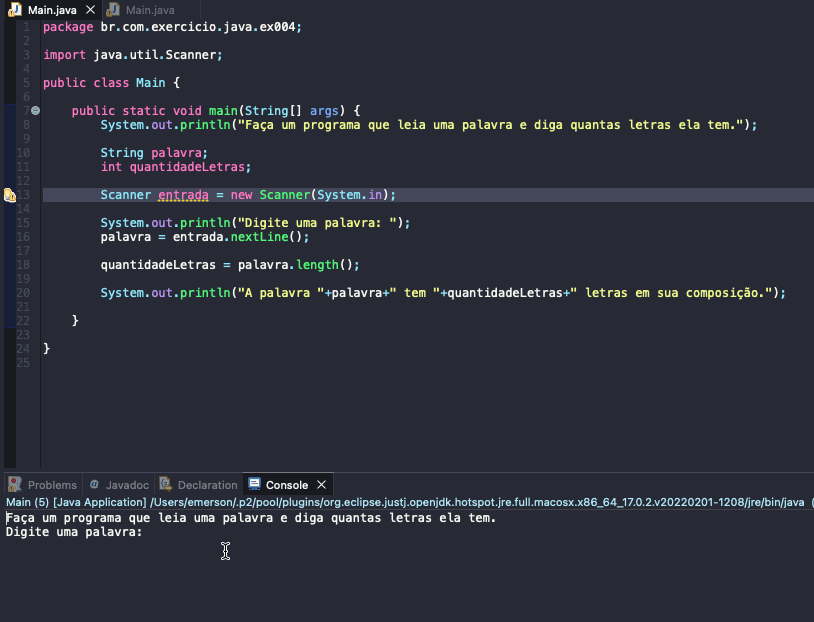

# Exercicio - Contando letras
- Faça um programa que leia uma palavra e diga quantas letras ela tem.

## Aplicação em uso.

### Entre em contato!

[Emerson Seiler](https://www.linkedin.com/in/seileremerson/)

