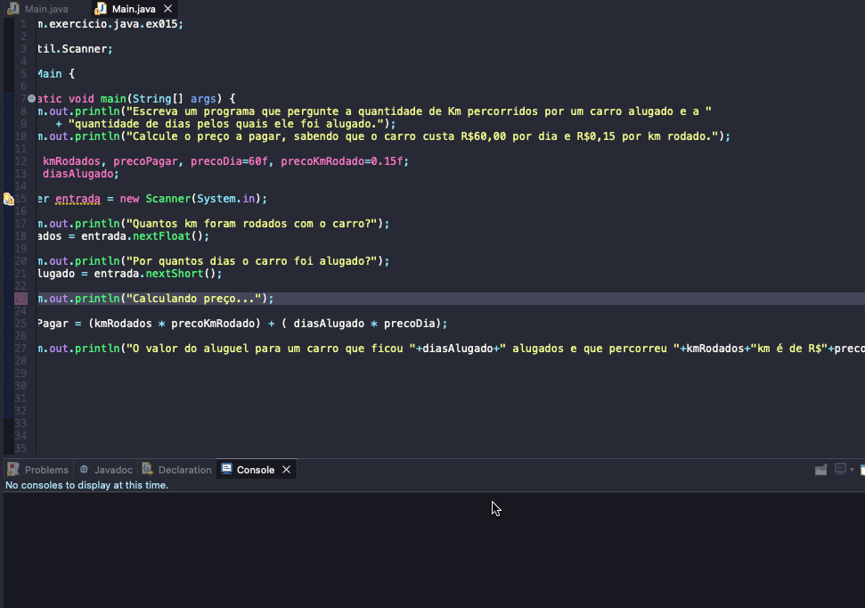

# Exercicio - Preço Aluguel Carro
- Escreva um programa que pergunte a quantidade de Km percorridos por um carro alugado e a quantidade de dias pelos quais ele foi alugado.
- Calcule o preço a pagar, sabendo que o carro custa R$60,00 por dia e R$0,15 por km rodado.

  
<b>Problem Description - PT-BR</b>

- Faça um programa que leia um número de 0 a 9999 e mostre na tela cada um dos dígitos separados.

## Aplicação em uso.

### Entre em contato!

[Emerson Seiler](https://www.linkedin.com/in/seileremerson/)

