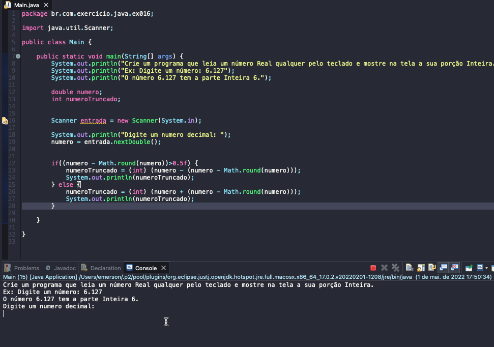

# Exercicio - Extraindo Parte Inteira
- Crie um programa que leia um número Real qualquer pelo teclado e mostre na tela a sua porção Inteira.
- Ex: Digite um número: 6.127
- O número 6.127 tem a parte Inteira 6.

## Aplicação em uso.

### Entre em contato!

[Emerson Seiler](https://www.linkedin.com/in/seileremerson/)

