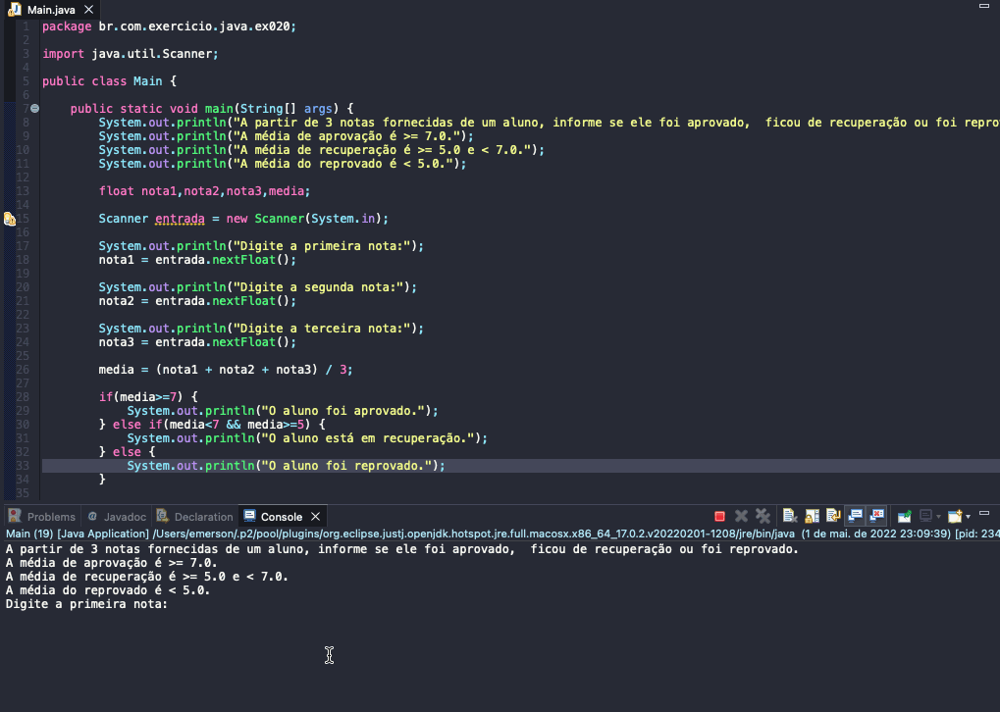

# Exercicio - Média Aprovação Aluno
- A partir de 3 notas fornecidas de um aluno, informe se ele foi aprovado,  ficou de recuperação ou foi reprovado.
- A média de aprovação é >= 7.0.
- A média de recuperação é >= 5.0 e < 7.0.
- A média do reprovado é < 5.0.

  
<b>Problem Description - PT-BR</b>

- Faça um programa que leia um número de 0 a 9999 e mostre na tela cada um dos dígitos separados.

## Application in use.

### Contact!

[Emerson Seiler](https://www.linkedin.com/in/seileremerson/)

