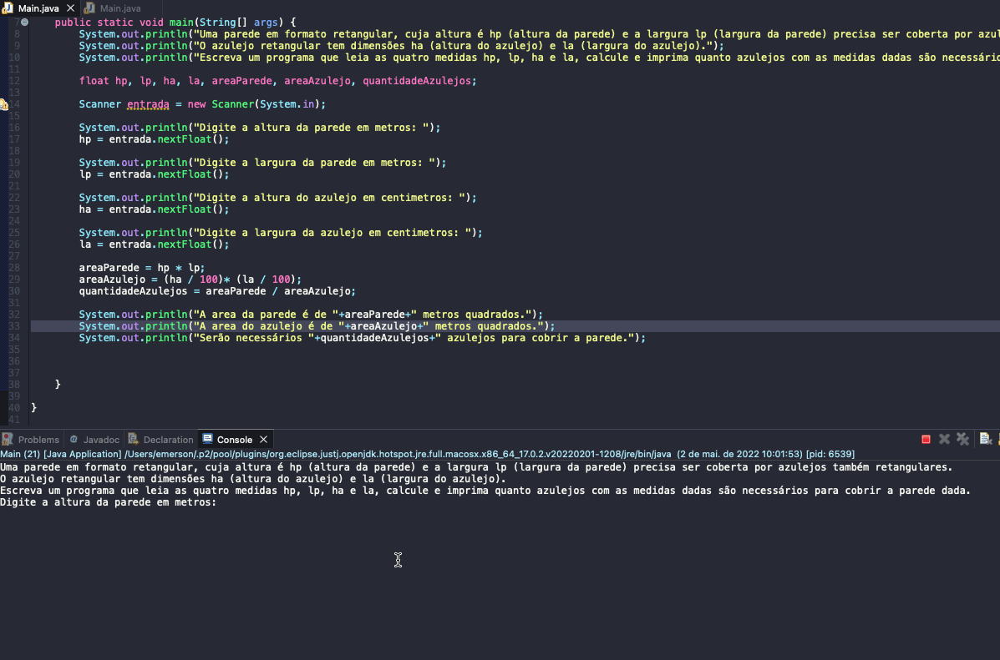

# Exercicio - Parede Azulejos
- Uma parede em formato retangular, cuja altura é hp (altura da parede) e a largura lp (largura da parede) precisa ser coberta por azulejos também retangulares.
- O azulejo retangular tem dimensões ha (altura do azulejo) e la (largura do azulejo).
- Escreva um programa que leia as quatro medidas hp, lp, ha e la, calcule e imprima quanto azulejos com as medidas dadas são necessários para cobrir a parede dada.

  
<b>Problem Description - PT-BR</b>

- Faça um programa que leia um número de 0 a 9999 e mostre na tela cada um dos dígitos separados.

## Aplicação em uso.

### Entre em contato!

[Emerson Seiler](https://www.linkedin.com/in/seileremerson/)

