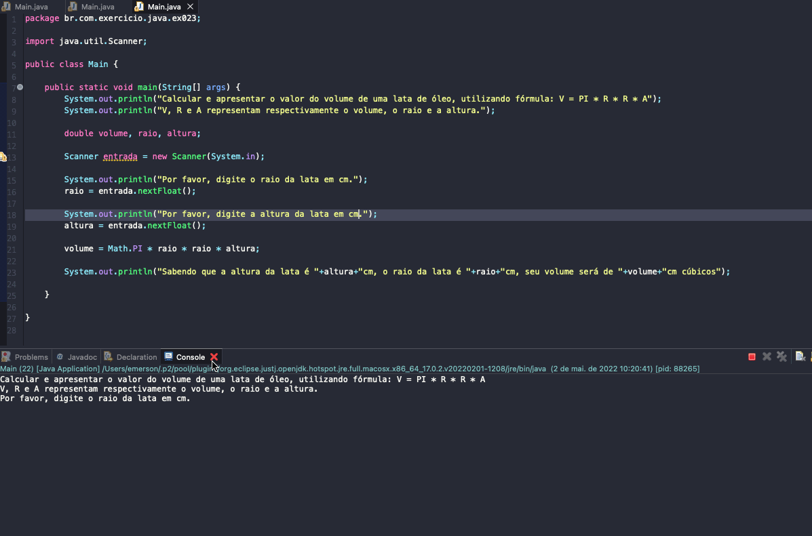

# Exercicio - Volume Lata
- Calcular e apresentar o valor do volume de uma lata de óleo, utilizando fórmula: V = PI * R * R * A;
- V, R e A representam respectivamente o volume, o raio e a altura.

## Aplicação em uso.

### Entre em contato!

[Emerson Seiler](https://www.linkedin.com/in/seileremerson/)

