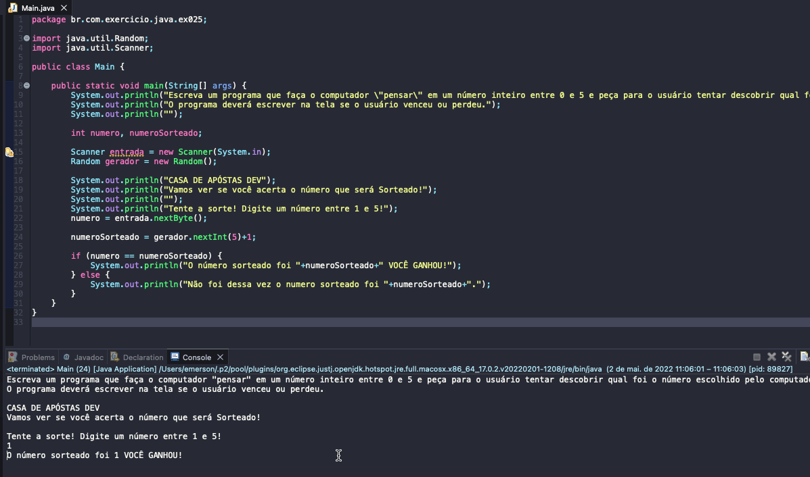

# Exercicio - Advinha o Número
- Escreva um programa que faça o computador "pensar" em um número inteiro entre 0 e 5 e peça para o usuário tentar descobrir qual foi o número escolhido pelo computador.
- O programa deverá escrever na tela se o usuário venceu ou perdeu.

## Aplicação em uso.

### Entre em contato!

[Emerson Seiler](https://www.linkedin.com/in/seileremerson/)

