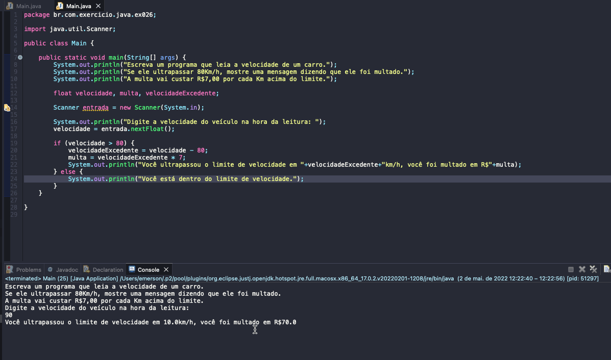

# Exercicio - Radar Eletrônico
- Escreva um programa que leia a velocidade de um carro.
- Se ele ultrapassar 80Km/h, mostre uma mensagem dizendo que ele foi multado.
- A multa vai custar R$7,00 por cada Km acima do limite.

  
<b>Problem Description - PT-BR</b>

- Faça um programa que leia um número de 0 a 9999 e mostre na tela cada um dos dígitos separados.

## Aplicação em uso.

### Entre em contato!

[Emerson Seiler](https://www.linkedin.com/in/seileremerson/)

