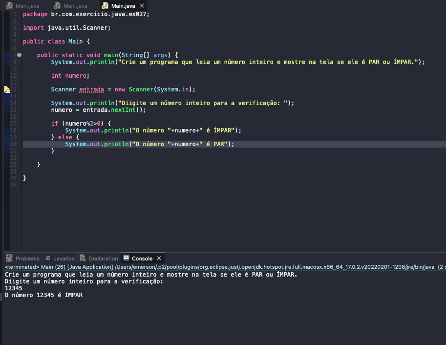

# Exercicio - Número Par ou Impar
- Crie um programa que leia um número inteiro e mostre na tela se ele é PAR ou ÍMPAR.

## Aplicação em uso.

### Entre em contato!

[Emerson Seiler](https://www.linkedin.com/in/seileremerson/)

