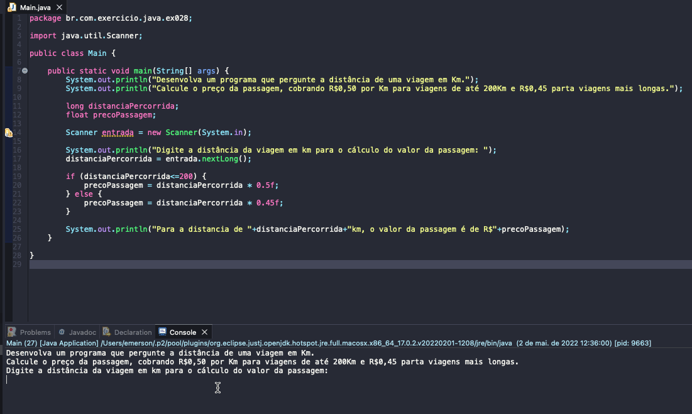

# Exercicio - Preço Passagem
- Desenvolva um programa que pergunte a distância de uma viagem em Km.
- Calcule o preço da passagem, cobrando R$0,50 por Km para viagens de até 200Km e R$0,45 parta viagens mais longas.

  
<b>Problem Description - PT-BR</b>

- Faça um programa que leia um número de 0 a 9999 e mostre na tela cada um dos dígitos separados.

## Application in use.

### Contact!

[Emerson Seiler](https://www.linkedin.com/in/seileremerson/)

