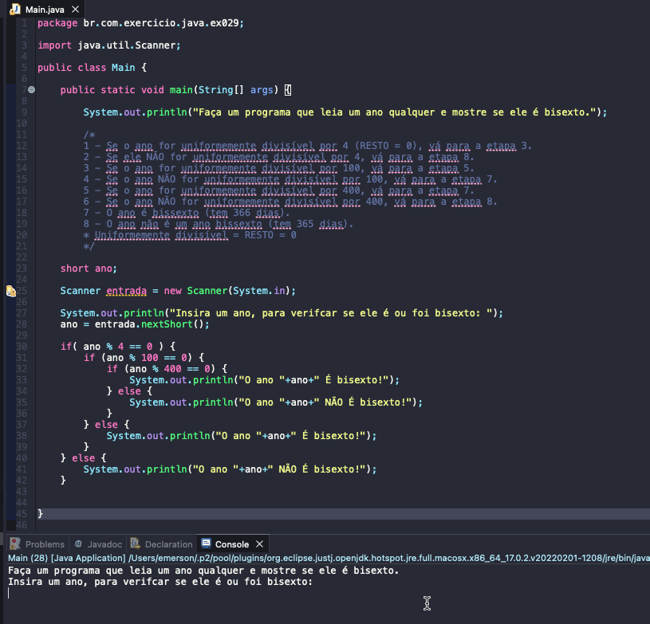

# Exercicio - Verificador Ano Bisexto
- Faça um programa que leia um ano qualquer e mostre se ele é bissexto.
- As condiçoes para um ano ser bisexto são:
```
    1 - Se o ano for uniformemente divisível por 4 (RESTO = 0), vá para a etapa 3.
    2 - Se ele NÃO for uniformemente divisível por 4, vá para a etapa 8.
    3 - Se o ano for uniformemente divisível por 100, vá para a etapa 5.
    4 - Se o ano NÃO for uniformemente divisível por 100, vá para a etapa 7.
    5 - Se o ano for uniformemente divisível por 400, vá para a etapa 7.
    6 - Se o ano NÃO for uniformemente divisível por 400, vá para a etapa 8.
    7 - O ano é bissexto (tem 366 dias).
    8 - O ano não é um ano bissexto (tem 365 dias).
    * Uniformemente divisível = RESTO = 0
```


## Aplicação em uso.



### Entre em contato!

[Emerson Seiler](https://www.linkedin.com/in/seileremerson/)

[](https://www.linkedin.com/in/seileremerson/)