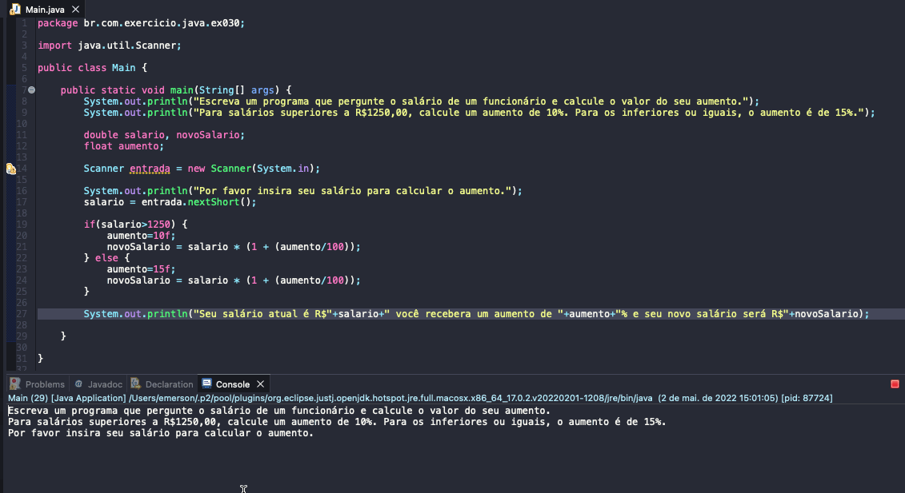

# Exercicio - Calculadora de Aumento
- Escreva um programa que pergunte o salário de um funcionário e calcule o valor do seu aumento.
- Para salários superiores a R$1250,00, calcule um aumento de 10%. Para os inferiores ou iguais, o aumento é de 15%.

  
<b>Problem Description - PT-BR</b>

- Faça um programa que leia um número de 0 a 9999 e mostre na tela cada um dos dígitos separados.

## Aplicação em uso.

### Entre em contato!

[Emerson Seiler](https://www.linkedin.com/in/seileremerson/)

