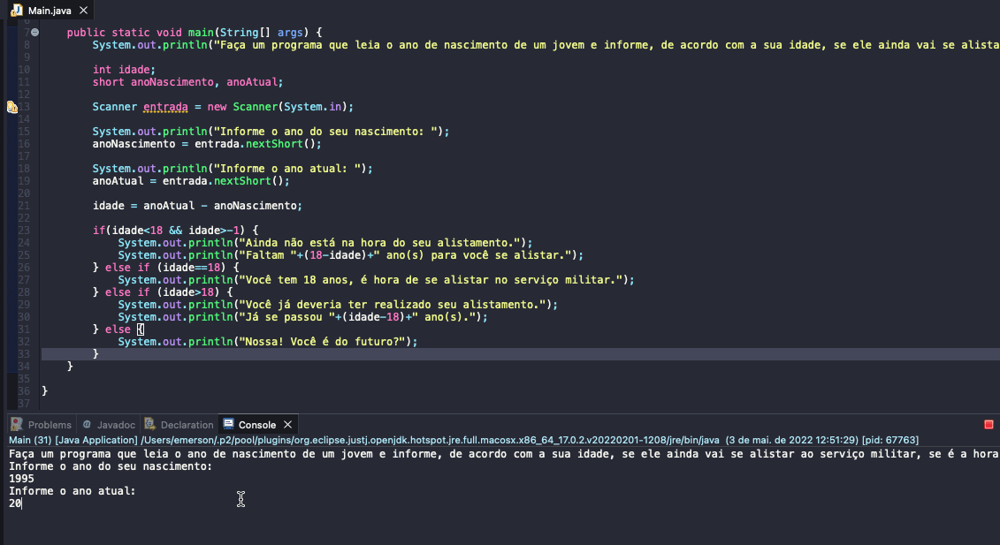

# Exercicio - Alistamento Militar
- Faça um programa que leia o ano de nascimento de um jovem e informe, de acordo com a sua idade, se ele ainda vai se alistar ao serviço militar, se é a hora exata de se alistar ou se já passou do tempo do alistamento.
- Seu programa também deverá mostrar o tempo que falta ou que passou do prazo.

  
<b>Problem Description - PT-BR</b>

- Faça um programa que leia um número de 0 a 9999 e mostre na tela cada um dos dígitos separados.

## Aplicação em uso.

### Entre em contato!

[Emerson Seiler](https://www.linkedin.com/in/seileremerson/)

