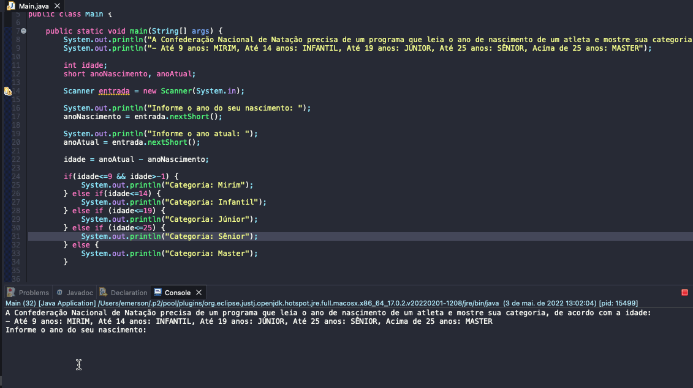

# Exercicio - Alistamento Militar
- A Confederação Nacional de Natação precisa de um programa que leia o ano de nascimento de um atleta e mostre sua categoria, de acordo com a idade:
````
- Até 9 anos: MIRIM
- Até 14 anos: INFANTIL
- Até 19 anos: JÚNIOR
- Até 25 anos: SÊNIOR
- Acima de 25 anos: MASTER
````

<details >
  <summary><b>Problem Description - PT-BR</b></summary>

- Faça um programa que leia um número de 0 a 9999 e mostre na tela cada um dos dígitos separados.

</details>

## Aplicação em uso.



### Entre em contato!

[Emerson Seiler](https://www.linkedin.com/in/seileremerson/)

[](https://www.linkedin.com/in/seileremerson/)