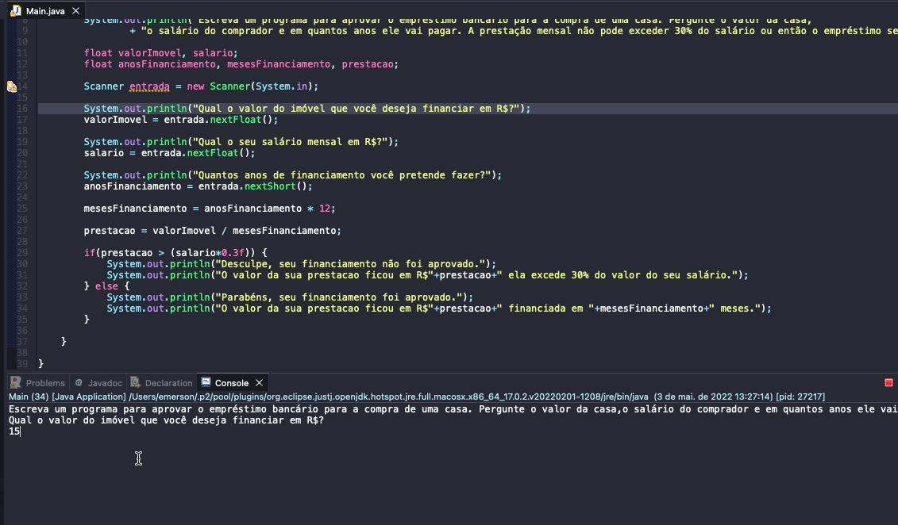

# Exercicio - Possível Formar Triângulo?
- Escreva um programa para aprovar o empréstimo bancário para a compra de uma casa. Pergunte o valor da casa, o salário do comprador e em quantos anos ele vai pagar. A prestação mensal não pode exceder 30% do salário ou então o empréstimo será negado.

## Aplicação em uso.

### Entre em contato!

[Emerson Seiler](https://www.linkedin.com/in/seileremerson/)

