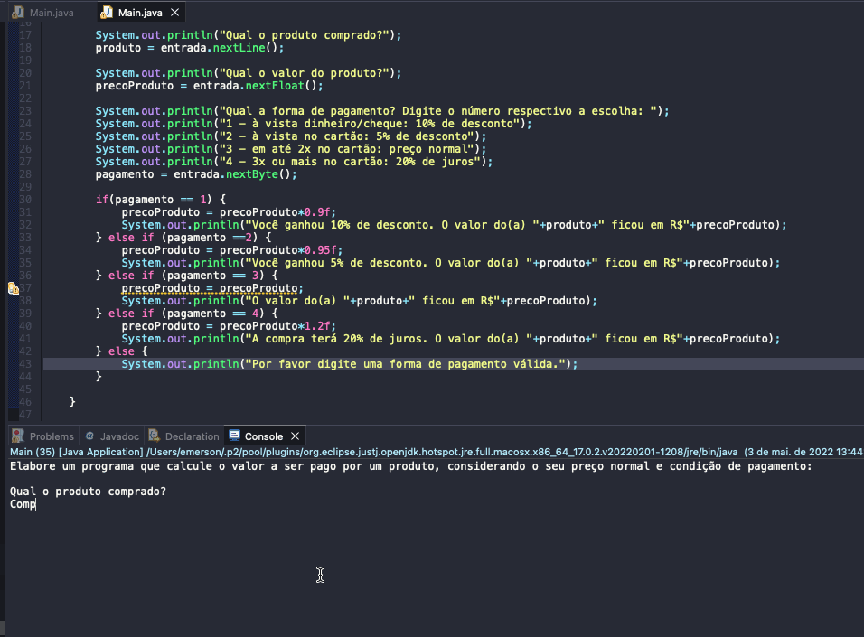

# Exercicio - Preço Produto
- Elabore um programa que calcule o valor a ser pago por um produto, considerando o seu preço normal e condição de pagamento:
````
- à vista dinheiro/cheque: 10% de desconto
- à vista no cartão: 5% de desconto
- em até 2x no cartão: preço normal
- 3x ou mais no cartão: 20% de juros
````

## Aplicação em uso.



### Entre em contato!

[Emerson Seiler](https://www.linkedin.com/in/seileremerson/)

[](https://www.linkedin.com/in/seileremerson/)