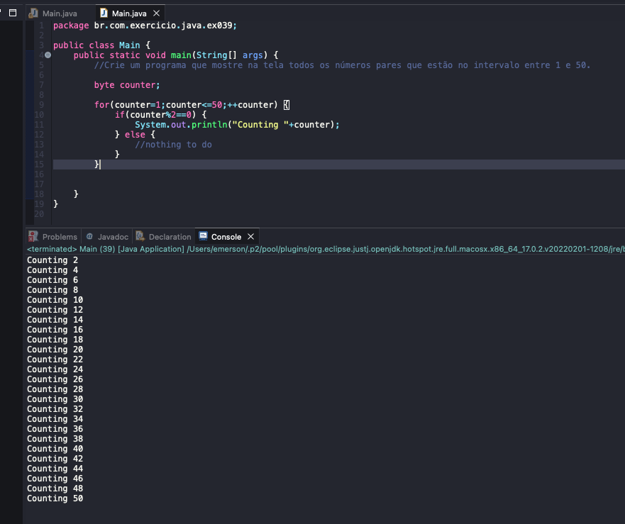

# Exercicio - Contando números
- Crie um programa que mostre na tela todos os números pares que estão no intervalo entre 1 e 50.

## Aplicação em uso.

### Entre em contato!

[Emerson Seiler](https://www.linkedin.com/in/seileremerson/)

