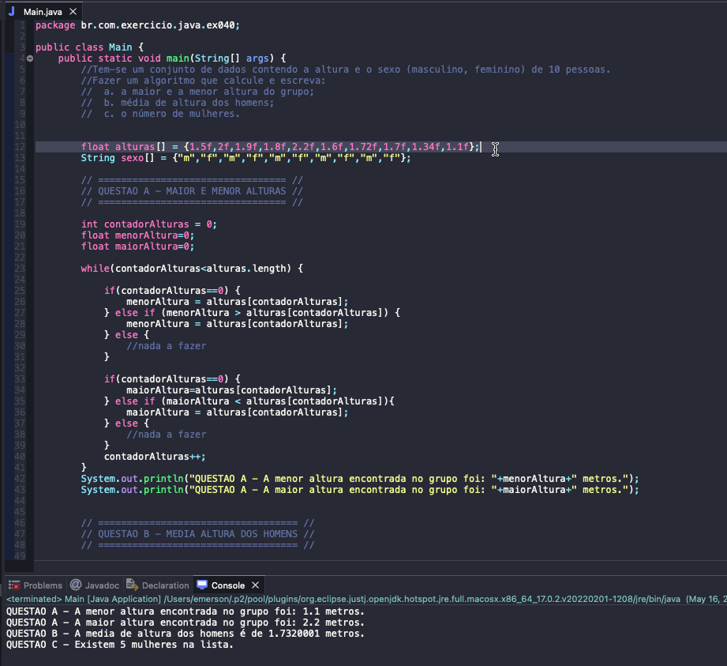

# Exercise - Reading list
- We have a dataset containing the height and gender (male, female) of 10 people.
- Make an algorithm that calculates and writes:
    1. The highest and lowest height of the group;
    2. Average height of men;
    3. The number of women.

## Application in use.

### Contact!

[Emerson Seiler](https://www.linkedin.com/in/seileremerson/)

