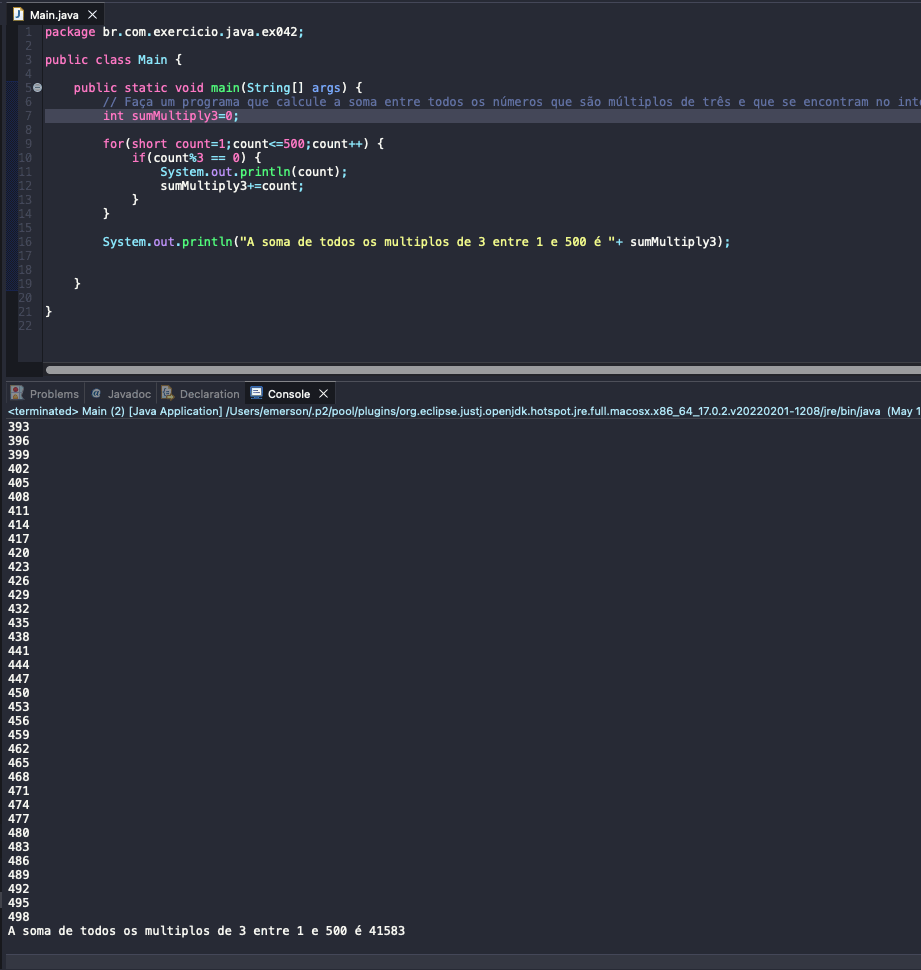

# Exercise - Sum Multiples of 3 between 1 and 500
- Write a program that calculates the sum of all numbers that are multiples of three and that lie in the range 1 to 500.

## Application in use.

### Contact!

[Emerson Seiler](https://www.linkedin.com/in/seileremerson/)

