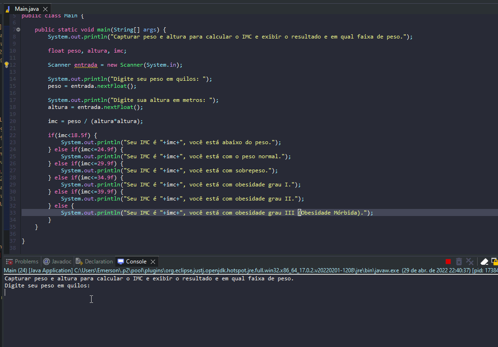

# Exercicio - Calculadora IMC
- Escreva um programa em que leia um número inteiro qualquer e peça para o usuário escolher qual será a base de conversão: 1 para binário, 2 para octal e 3 para hexadecimal.

## Aplicação em uso.

### Entre em contato!

[Emerson Seiler](https://www.linkedin.com/in/seileremerson/)

